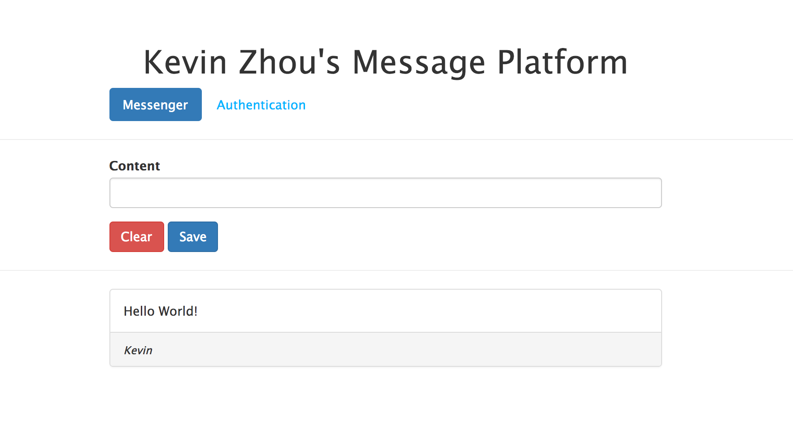

# RBAC Message Forum 

### Introduction:
This is a self-instructed project to deploy a mean stack message platform engaging the RBAC access control strategy.

+ **What is MEAN**

The term MEAN stack refers to a collection of JavaScript based technologies used to develop web applications. MEAN is an acronym for MongoDB, ExpressJS, AngularJS and Node.js. From client to server to database, MEAN is full stack JavaScript.

+ **Basic Workfolw**

    + _A single page application_ involves:
      1. Client initiate the request
      2. Angular handles it and forwards to node server
      3. Express works with Node to commmunicate with the database
      4. Return the result to Angular and let it render the page 

+ **Mind Map**

#### How to use:
>- Download the entire folder.      
- Run "**npm install**" to install all required dependencies.
- Run "**npm run build**" to run the development build script => Keep this process running! 
- Run "**npm start**" in a new command line/ terminal window => Keep this process running as well, it's your NodeJS server. 
 
>**Note**: Remember to install two other dependencies(bcryptjs & jsonwebtoken) using "**npm install —save**" 

**Ps**: I've already deploy this on Amazon AWS, you view it through.[Kevin Zhou's Message Platform](http://mean-stack-deployment.us-east-1.elasticbeanstalk.com)
## **Demo**

       
  
